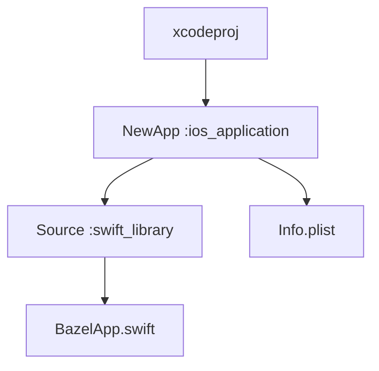
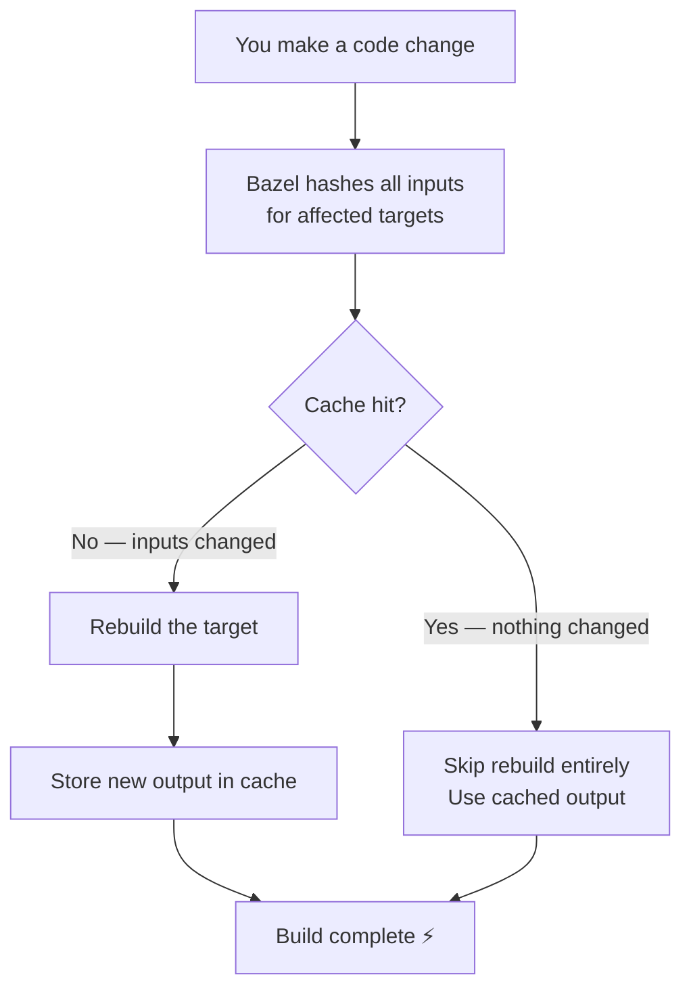

# From Xcode Slowness to Bazel Superpowers: A Beginner's Guide to Bazel for iOS

*Google uses it. Uber uses it. Airbnb uses it. Here's how you can use it too — from scratch, in under an hour.*

---

## Why Bazel? (The Pain First)

Picture this: you change one line in a utility file. You hit `Cmd+B`. Xcode decides to recompile half your project. Your MacBook fan spins up like it's about to take off. You go make coffee. You come back. It's still building.

<!-- GIF: Search "waiting forever" or "this is fine dog fire" on Hashnode's GIF picker -->

Sound familiar?

Xcode's build system is fine for small apps. But as projects grow — more files, more targets, more developers — it starts to crack. There's no real caching, builds aren't reproducible across machines, and CI pipelines become a 20-minute waiting game.

This is the problem Bazel was built to solve.

### What is Bazel?

Bazel is an open-source build system originally developed at Google (internally called Blaze). It's the same system used to build Google Search, Gmail, and Android. Companies like Uber, Airbnb, and Spotify use it for their iOS monorepos.

The key ideas behind Bazel:

- **Hermetic builds** — Bazel controls every input to a build. Same code + same machine = identical output, every time.
- **Intelligent caching** — Bazel hashes your inputs. If nothing changed, nothing rebuilds. This works locally *and* across your whole team on CI.
- **Incremental by design** — Only the targets affected by your change get rebuilt. Not half the project.
- **Language agnostic** — One build system for Swift, Kotlin, C++, Go, Python. Useful when you're scaling to a monorepo.
- **Xcode compatible** — Thanks to `rules_xcodeproj`, you still get a full `.xcodeproj` to work with. You don't have to give up your IDE.

Bazel has a reputation for being complex. That reputation isn't wrong — but the basics are simpler than you'd think.

> **Up next:** We'll look at the exact files you need to build a real iOS app with Bazel. Spoiler: it's just 5 files. Yes, really.

---

## What You'll Build

By the end of this post, you'll have a working iOS SwiftUI app built entirely with Bazel. You'll be able to run it in Xcode, build it from the terminal, and understand every file in the project.

Here's the final project structure:

```
MyApp/
├── MODULE.bazel          # Dependencies (like Package.swift)
├── BUILD.bazel           # Build rules (your targets)
├── .bazelrc              # Bazel configuration flags
├── Sources/
│   └── BazelApp.swift    # Your SwiftUI app
└── Resources/
    ├── BUILD.bazel        # Exports Info.plist to Bazel
    └── Info.plist         # Standard iOS app info
```

No `Podfile`. No `Package.swift`. No `Cartfile`. Just five files and a SwiftUI view.

### Prerequisites

Before we start, make sure you have:

```bash
# Install Bazel via Homebrew
brew install bazel

# Verify
bazel --version
```

You'll also need Xcode installed with a valid simulator. That's it.

> **Up next:** The actual SwiftUI app — then we'll explain how Bazel knows to build it.

---

## The App We're Building

The SwiftUI code is intentionally simple — the point is the *build system*, not the UI:

```swift
// Sources/BazelApp.swift
import SwiftUI

@main
struct BazelApp: App {
    var body: some Scene {
        WindowGroup {
            VStack {
                Text("Hello, world!")
            }
        }
    }
}
```

A standard SwiftUI entry point. Nothing special here — and that's the point. Bazel doesn't care what your Swift code looks like. It just needs to know *how* to build it.

Which brings us to the most important question: how does Bazel actually know what to do?

> **Up next:** `MODULE.bazel` — the file that tells Bazel about the outside world.

---

## MODULE.bazel — Your Dependency Manager

Create a file called `MODULE.bazel` at your project root:

```python
bazel_dep(name = "rules_apple", version = "3.15.0", repo_name = "build_bazel_rules_apple")
bazel_dep(name = "rules_swift", version = "2.2.0", repo_name = "build_bazel_rules_swift")
bazel_dep(name = "rules_xcodeproj", version = "2.9.2")
```

Think of `MODULE.bazel` as your `Package.swift` — except it manages the *build system's* dependencies, not your app's. It tells Bazel which external rule sets to download.

Here's what each line does:

**`rules_apple`** — Provides iOS-specific build rules like `ios_application`. Without this, Bazel doesn't know how to build an `.ipa` or run an app on a simulator.

**`rules_swift`** — Provides `swift_library` and `swift_binary`. Bazel's core doesn't know Swift exists — this rule set teaches it.

**`rules_xcodeproj`** — The magic rule that generates a `.xcodeproj` from your Bazel targets. This is how you keep using Xcode while Bazel handles the actual building.

> *Think of MODULE.bazel as your Package.swift — except it doesn't pick a fight with Xcode every time you open the project.*

### Enable Bzlmod

Create `.bazelrc` at your project root:

```
common --enable_bzlmod
```

One line. That's it.

This flag tells Bazel to use **Bzlmod** — its modern, module-based dependency system. `MODULE.bazel` only works when Bzlmod is enabled. Without this flag, Bazel falls back to the older `WORKSPACE` approach and ignores your `MODULE.bazel` entirely.

> *You've seen `Podfile`s longer than this just to install Alamofire.*

<!-- GIF: Search "one does not simply" or "that was easy" on Hashnode's GIF picker -->

> **Up next:** `BUILD.bazel` — the heart of Bazel where you actually define your app target. This is where the magic (and the confusion) happens. Don't worry, we'll go line by line.

---

## BUILD.bazel — The Heart of Bazel

This is where things get interesting. Create `BUILD.bazel` at the project root:

```python
load("@build_bazel_rules_apple//apple:ios.bzl", "ios_application")
load("@build_bazel_rules_swift//swift:swift.bzl", "swift_library")
load("@rules_xcodeproj//xcodeproj:defs.bzl", "xcodeproj", "top_level_target")

swift_library(
    name = "Source",
    srcs = glob([
        "Sources/**/*.swift"
    ]),
    visibility = ["//visibility:public"],
)

ios_application(
    name = "NewApp",
    bundle_id = "com.yourname.ios",
    families = ["iphone"],
    infoplists = ["//Resources:Info.plist"],
    minimum_os_version = "17.0",
    deps = [":Source"],
    visibility = ["//visibility:public"],
)

xcodeproj(
    name = "xcodeproj",
    project_name = "MyApp",
    top_level_targets = [
        top_level_target(":NewApp", target_environments = ["simulator"]),
    ],
)
```

Let's break this down piece by piece.

### load() — Importing Rules

```python
load("@build_bazel_rules_apple//apple:ios.bzl", "ios_application")
```

`load()` is how you import rules into a BUILD file — like `import` in Swift. Each rule you use must be explicitly loaded from its source.

### swift_library

```python
swift_library(
    name = "Source",
    srcs = glob(["Sources/**/*.swift"]),
    visibility = ["//visibility:public"],
)
```

This compiles all your Swift files into a library named `Source`.

- `glob(["Sources/**/*.swift"])` — finds all `.swift` files recursively. Same as `**/*.swift` in your terminal.
- `visibility = ["//visibility:public"]` — allows other targets (like your app) to depend on this library.

### ios_application

```python
ios_application(
    name = "NewApp",
    bundle_id = "com.yourname.ios",
    families = ["iphone"],
    infoplists = ["//Resources:Info.plist"],
    minimum_os_version = "17.0",
    deps = [":Source"],
)
```

This is your app target — equivalent to your Xcode application target.

The key attribute is `deps = [":Source"]`. The `:` prefix means *"a target defined in this same BUILD file."* This is how Bazel knows to compile `Source` before building `NewApp`.

### xcodeproj

```python
xcodeproj(
    name = "xcodeproj",
    project_name = "MyApp",
    top_level_targets = [
        top_level_target(":NewApp", target_environments = ["simulator"]),
    ],
)
```

This generates your `.xcodeproj` file so Xcode stays happy. Best of both worlds.

> *Your entire app configuration is 25 lines. Your `project.pbxproj` has entered the chat... and it's crying.*

<!-- GIF: Search "crying laughing" or "ugly cry" on Hashnode's GIF picker -->

### How Bazel Sees Your Project

Bazel models your build as a **dependency graph** — each target is a node, and `deps` are edges. Here's what your project looks like:



This graph is why Bazel is fast. When you change `BazelApp.swift`, Bazel walks the graph and only rebuilds `Source` and `NewApp`. Everything else is untouched.

> **Up next:** A tiny but important file — and then the thing everyone really wants to know: *why exactly is Bazel faster?* The caching system is honestly clever. Let's visualise it.

---

## Resources/BUILD.bazel

Create `Resources/BUILD.bazel`:

```python
exports_files([
    "Info.plist"
])
```

Short and sweet. This makes `Info.plist` visible to the root `BUILD.bazel` via `//Resources:Info.plist`. Without this, Bazel's sandbox can't see files outside the current package.

---

## How Bazel Caching Works

Before you run your first build, it's worth understanding *why* Bazel is faster than Xcode for repeated builds.

Xcode's incremental build system uses file timestamps. It asks: *"Has this file been modified since last build?"* It works, but it's imprecise — a `touch` on a file triggers a rebuild even if nothing changed.

Bazel uses **content hashing**. It asks: *"Have the actual contents of every input changed?"* Here's the full flow:



The cache works **locally** (your machine) and can be extended to a **remote cache** shared across your team and CI. When your teammate builds the same commit you already built, they get your cached outputs. Zero rebuild.

This is the real superpower — not just fast local builds, but a shared build cache that makes CI fast too.

<!-- GIF: Search "mind blown" or "galaxy brain" on Hashnode's GIF picker -->

> **Up next:** All files are ready. Time to actually run the build. Three commands and you'll have a working iOS app built entirely by Bazel — opening in Xcode.

---

## Running Your First Build

You have all the files. Let's build.

**Step 1: Generate the Xcode project**

```bash
bazel run //:xcodeproj
```

This runs the `xcodeproj` target, which generates `MyApp.xcodeproj`. The `//` means "from the project root", `:xcodeproj` is the target name.

**Step 2: Build the app**

```bash
bazel build //:NewApp
```

First run will be slow — Bazel downloads dependencies and builds from scratch. Grab that coffee you didn't get to finish earlier. Subsequent builds will be dramatically faster thanks to caching.

Expected output:
```
INFO: Analyzed target //:NewApp
INFO: Found 1 target...
Target //:NewApp up-to-date:
  bazel-bin/NewApp.ipa
INFO: Build completed successfully
```

**Step 3: Open in Xcode**

```bash
open MyApp.xcodeproj
```

Select a simulator, hit `Cmd+R`. Your app runs.

<!-- GIF: Search "success kid" or "nailed it" on Hashnode's GIF picker -->

### Understanding Bazel Target Syntax

The `//` and `:` syntax trips up every beginner. Here's the rule:

| Syntax | Meaning |
|---|---|
| `//` | Project root |
| `//:NewApp` | Target `NewApp` in the root `BUILD.bazel` |
| `//Resources:Info.plist` | File `Info.plist` in the `Resources` package |
| `:Source` | Target `Source` in the *current* BUILD file |

> *When it builds successfully on the first try, you will feel like an absolute wizard. When it doesn't — welcome to the club. We have snacks and Stack Overflow tabs.*

> **Up next:** The question you've been asking yourself this whole time — *should I actually use this on my real project?* Honest answer ahead.

---

## Should YOU Adopt Bazel?

Honest answer: it depends. Here's a clear breakdown:

### Use Bazel if:
- Your team has **3+ iOS developers** and builds are slowing everyone down
- Your **CI pipeline takes more than 10 minutes** and remote caching would help
- You're moving toward a **monorepo** with shared code across platforms
- You need **reproducible builds** — same output on every machine, every time
- You're planning to scale and want the build system to scale with you

### Stick with Xcode if:
- You're a **solo developer** on a relatively small app
- Your team has **no bandwidth** for the initial setup investment
- You're **under deadline pressure** — Bazel has a real learning curve
- Your project is **simple enough** that Xcode's build system handles it fine

> *Bazel is like a standing desk — amazing long-term investment, great for your health, but the first week you'll wonder why you did this to yourself. Stick with it.*

<!-- GIF: Search "long term investment" or "worth it" on Hashnode's GIF picker -->

The sweet spot for Bazel is mid-to-large teams with growing codebases. For solo developers and small teams, the overhead may not be worth it yet.

---

## What's Next

You just built an iOS app with Bazel from scratch. Here's where to go from here:

- **Add third-party dependencies** — Integrate Swift packages via `rules_swift_package_manager`
- **Multi-module setup** — Split your app into multiple `swift_library` targets for faster incremental builds
- **Remote caching** — Set up a shared cache with Buildbuddy or Google Cloud Storage for blazing fast CI
- **Explore the Bazel ecosystem** — `rules_apple` supports watchOS, tvOS, and macOS targets too

The full project from this post is on GitHub — clone it, explore the files, and use it as your starting point:

**[github.com/Hitarthbhatt/bazel-ios-starter](https://github.com/Hitarthbhatt/bazel-ios-starter)**

I built this to understand Bazel properly. The first build failed five times. The sixth worked, and I immediately understood why teams adopt this. If I can get here, you can too.

---

*Found this useful? Share it with an iOS dev who's tired of slow builds. Have questions? Drop them in the comments — I'd love to help.*
